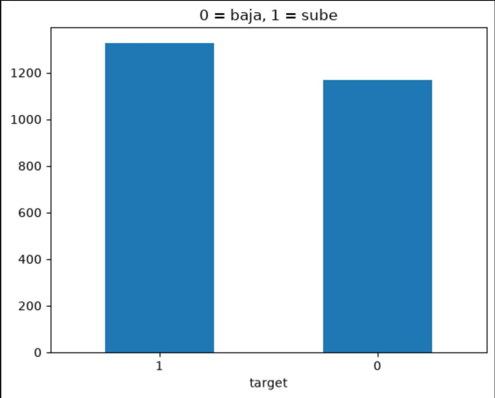
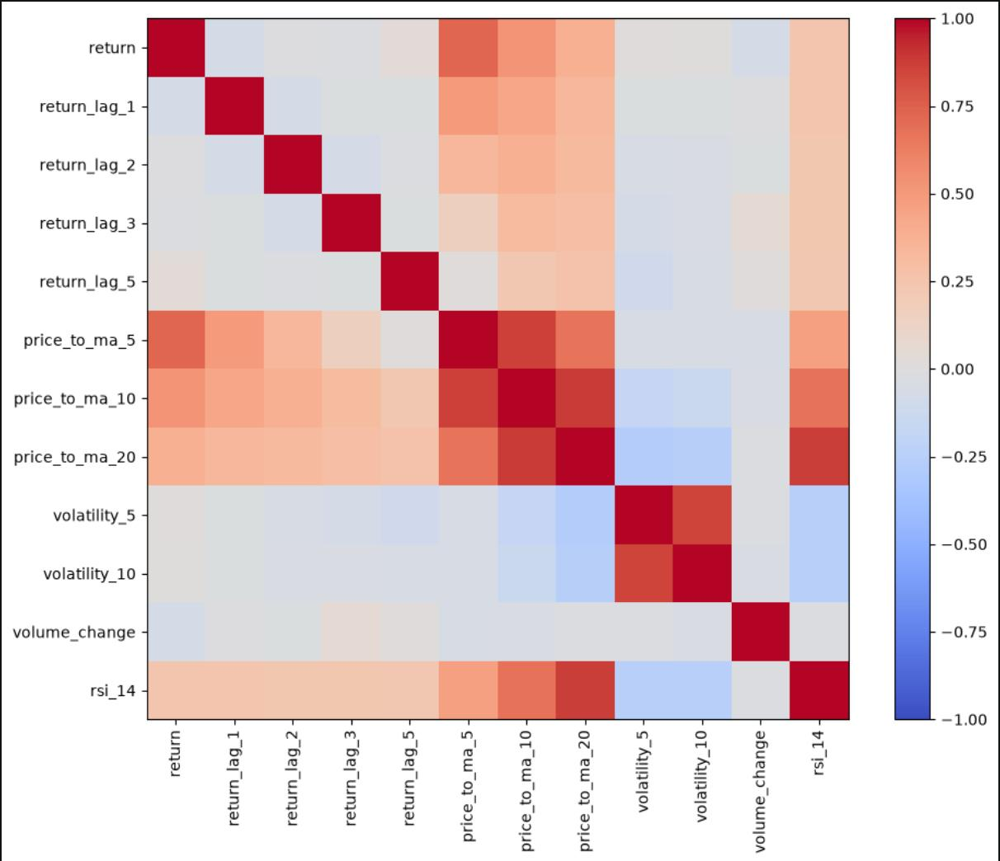
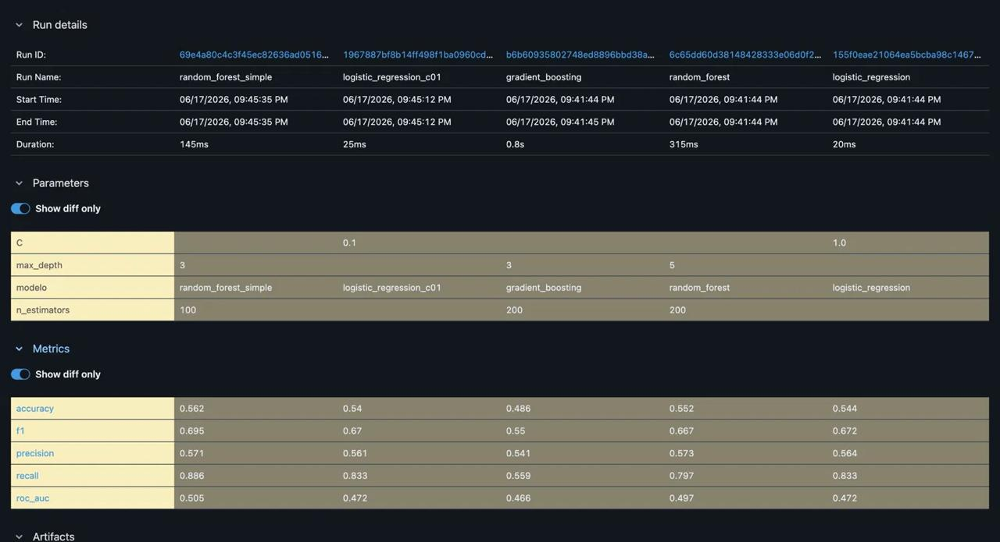
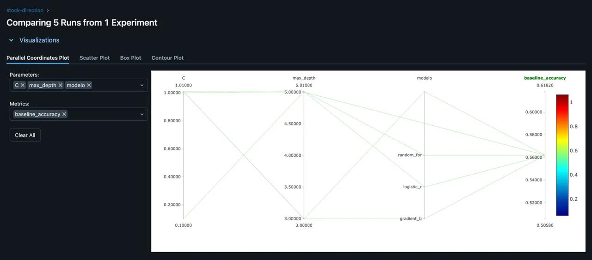

# Apple Stock Direction Prediction — An MLOps Pipeline

A reproducible machine-learning pipeline that predicts whether **Apple (AAPL)** stock will close **up or down the next trading day**. The project covers the full MLOps cycle: data acquisition, feature engineering, experiment tracking with MLflow, model selection, and automated CI/CD with on-demand batch inference — all under a Git branch / pull-request workflow.

> University project for the *MLOps and System Design* course.

---

## Problem Statement

**Task.** Given the recent price history of Apple, predict the direction of the next day's close. This is framed as a **binary classification** problem:

- `1` → the next day's close is higher than today's (the stock goes **up**).
- `0` → the next day's close is lower or equal (the stock goes **down**).

We chose direction (classification) over price (regression) on purpose: it yields a richer set of evaluation metrics (accuracy, precision, recall, F1, ROC-AUC) and avoids the misleading "naive" baseline that a regression on prices tends to produce.

**Data.** Daily OHLCV data for AAPL (2015–2024, ~2,500 trading days) is pulled from **Yahoo Finance** via the `yfinance` library. A CSV snapshot (`datasets/historico.csv`) is committed as a fallback, so the pipeline stays **reproducible** even if the API is unavailable inside a CI runner.

**Design decisions.**
- **Temporal split (no shuffle):** the first 80% of the timeline is used for training and the last 20% for testing, to avoid look-ahead bias — a model must never "see the future".
- **Snapshot fallback:** if the live download fails, the pipeline transparently falls back to the committed snapshot.
- **Offline / batch inference:** predictions are produced on demand over a batch file, so real-time latency is not a constraint.
- **Single pipeline object:** scaling and the classifier are wrapped in one `scikit-learn` `Pipeline`, so the exact same transformations are applied at training and prediction time.

---

## Project Structure

```
mlops-proyecto-acciones/
├── main.py                       # entry point: python main.py [train|predict]
├── requirements.txt              # pinned dependencies
├── .flake8                       # lint configuration
├── .github/workflows/            # ci.yml, cd.yml, on_demand.yml
├── src/
│   ├── data.py                   # data download (with fallback) + feature engineering
│   ├── train.py                  # trains the model, logs to MLflow, saves models/model.pkl
│   └── predict.py                # batch prediction over the on-demand dataset
├── datasets/historico.csv        # data snapshot (fallback)
├── models/model.pkl              # trained model artifact
├── batch_prediction_dataset/     # on_demand_dataset.csv + predictions.csv
├── notebooks/                    # 01_eda.ipynb, 02_experiments.ipynb
└── images/                       # figures used in this document
```

---

## Setup

The project runs on **Python 3.12** (the pinned dependencies, e.g. `numpy 2.4.4`, target this version, and the CI/CD workflows use it too).

```bash
# 1. Clone and enter the repo
git clone https://github.com/nicoputs/mlops-proyecto-acciones.git
cd mlops-proyecto-acciones

# 2. Create the environment (conda or venv) with Python 3.12 and install deps
pip install -r requirements.txt

# 3. Train the model (logs an MLflow run and writes models/model.pkl)
python main.py train

# 4. Run a batch prediction over batch_prediction_dataset/on_demand_dataset.csv
python main.py predict

# 5. Inspect experiments in the MLflow UI
mlflow ui
```

---

## Model Development

### Exploratory data analysis

The two classes are close to balanced (~54% up / ~46% down), which means the **majority-class baseline** sits at about **0.549 accuracy** — the bar every model must beat.



The engineered features were checked for redundancy. As expected, the moving-average ratios (`price_to_ma_*`) are strongly correlated with each other, and the volatility features form their own cluster, while lagged returns are mostly independent.



### Feature engineering

From the raw OHLCV series we derive **12 features**, all computed without leaking future information:

- **Returns:** `return` (daily return) and its lags `return_lag_1`, `return_lag_2`, `return_lag_3`, `return_lag_5`.
- **Trend / momentum:** `price_to_ma_5`, `price_to_ma_10`, `price_to_ma_20` (price relative to its moving averages).
- **Volatility:** `volatility_5`, `volatility_10` (rolling standard deviation of returns).
- **Volume:** `volume_change`.
- **Oscillator:** `rsi_14` (14-day Relative Strength Index).

### Experiment tracking

We trained and logged **five runs** in an MLflow experiment named `stock-direction`, each wrapped in a `StandardScaler` + classifier pipeline and evaluated with five metrics plus the baseline. The results on the held-out test set:

| Model                     | Accuracy | Precision | Recall | F1    | ROC-AUC |
|---------------------------|:--------:|:---------:|:------:|:-----:|:-------:|
| logistic_regression       | 0.544    | 0.564     | 0.833  | 0.672 | 0.472   |
| random_forest             | 0.552    | 0.573     | 0.797  | 0.667 | 0.497   |
| gradient_boosting         | 0.486    | 0.541     | 0.559  | 0.550 | 0.466   |
| logistic_regression_c01   | 0.540    | 0.561     | 0.833  | 0.670 | 0.472   |
| **random_forest_simple**  | **0.562**| 0.571     | **0.886** | **0.695** | **0.505** |





### Model selection

The selected model is **`random_forest_simple`**: a `RandomForestClassifier(n_estimators=100, max_depth=3, random_state=42)`. It was chosen because it:

- achieves the **best accuracy (0.562), F1 (0.695) and recall (0.886)**,
- is the **only model with ROC-AUC above 0.5** (0.505), i.e. the only one performing better than random ranking, and
- is **simpler** than the 200-tree random forest, giving the best balance between performance and complexity.

The winning configuration was promoted into `src/train.py`, so the automated CD pipeline retrains and ships exactly this model.

---

## CI/CD and Automation

The repository defines three GitHub Actions workflows:

- **CI** (`ci.yml`) — runs on every **pull request**. Checks code formatting with `black` and style with `flake8`, so nothing reaches `main` without passing quality gates.
- **CD** (`cd.yml`) — runs on every **push to `main`**. Installs dependencies, retrains the model, and commits the updated `models/model.pkl` back to the repository.
- **On-Demand Prediction** (`on_demand.yml`) — triggered **manually**. Runs a batch prediction over `batch_prediction_dataset/on_demand_dataset.csv` and commits the resulting `predictions.csv`.

Development followed a **branch → pull request → review → merge** workflow, so every change is traceable through its PR.

---

## Conclusions

This project delivers a **complete, reproducible MLOps pipeline**: data acquisition with a robust fallback, transparent feature engineering, experiment tracking across five models and five metrics, automated retraining (CD), automated quality checks (CI), and on-demand batch inference — all version-controlled.

On the predictive side, the results are deliberately reported with honesty. The best model reaches **0.562 accuracy against a 0.549 baseline**, and a **ROC-AUC of ~0.505** — only marginally better than chance. Predicting the *daily* direction of a liquid stock is genuinely hard, and this outcome is consistent with the **(weak-form) efficient market hypothesis**: short-term moves are close to unpredictable from price history alone. The value of this work lies in the engineering pipeline and the disciplined methodology, not in beating the market.

**Limitations and future work.** Performance could be explored further with additional signals (macroeconomic indicators, news sentiment), longer prediction horizons, walk-forward cross-validation, a wider hyperparameter search, probability calibration, and extending the approach to multiple tickers.

---

## Team

| Member           | GitHub                    | Contribution                                                                                                  |
|------------------|---------------------------|---------------------------------------------------------------------------------------------------------------|
| Nicolas Santis   | `nicoputs`                | Infrastructure: repository, project structure, data acquisition, dependencies, CI/CD and on-demand workflows. |
| Alejandro Ospina | `alejandroospina-at-eada` | Modeling: exploratory analysis, experiment design and tracking, model selection, and final training code.     |
